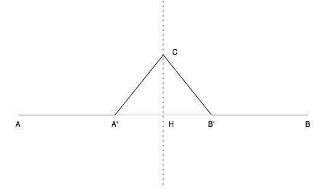

## INSTRUCTIONS

From a base triangle, draw a Koch Snowflake ([wikipedia](https://en.wikipedia.org/wiki/Koch_snowflake)).
A Koch Snowflake is a fractal curve built up iteratively from a base equilateral triangle. 

At each iteration, draw a new equilateral triangle of size `1/3 * base segment` for each segment of the triangle.

For this excercise we'll be using the `p5.js` library ([p5js.org](https://p5js.org/reference/)).

*the first four iteration of Koch snowflake:*


*the first seven iteration of Koch snowflake:*


## COMPUTE 

To plot the next iteration of *Koch snowflake* from the previous step , we need to divide each segment in `1/3` and calculate the coordonate of the new point.



We have the following relations:

```
vec(AA') = (1/3) * vec(AB)

vec(AB') = (1/3) * vec(AB)

vec(AC) = vec(AH) + vec(CH) = (1/2) * vec(AB) + vec(CH)

```

and like the triangle `A'CB'` is equilateral, we have:

```
angle(B'A'C) = angle(B'CA') = angle(A'B'C) = PI / 3  
```

*remider:*

```
cos(PI/3) = 1 / 2

sin(PI/3) = sqrt(3) / 2
```


## FILES

- `main.js` => the main file, called in index.html.
- `const.js` => predefined constants (triangle size, the first three segments to draw our triangle, center of the window, etc.)
- `draw.js` => file with definitions of drawings methods (optional, you can define them in `main.js`)

## P5 METHOD AND OBJECT

`sketch` : p5 sketch object, containing all the method to draw/redraw/erase/fill etc.

`sketch.setup()` : setup method, called once on initialisation

`sketch.draw()` : draw method, called continuously
 - `sketch.noLoop()` : prevent `draw()` method from looping
 - `sketch.loop()` : activate loop for `draw()` method
 - `sketch.redraw()` : call `draw()` method

`sketch.createSlider(min, max, startValue)` : method creating a slider, specifying the minimum, maximum and start value. It returns the created `slider`
 - `slider` methods:
   - `slider.position(x, y)` : place the slider at (x,y) position
   - `slider.value()` : to get the slider value
   - `slider.value(x)`: set slider value to x (number)
   - `slider.input(() => {})`: set a callback when the slider value change

`sketch.triangle(x1, y1, x2, y2, x3, y3)`: draw a triangle from points of coordinates (x1,y1), (x2, y2) and (x3, y3), returning the triangle created

`sketch.fill("#FFFFFF")`: fill color of the drawings, specify a hexadecimal value or 3 values R,G,B
